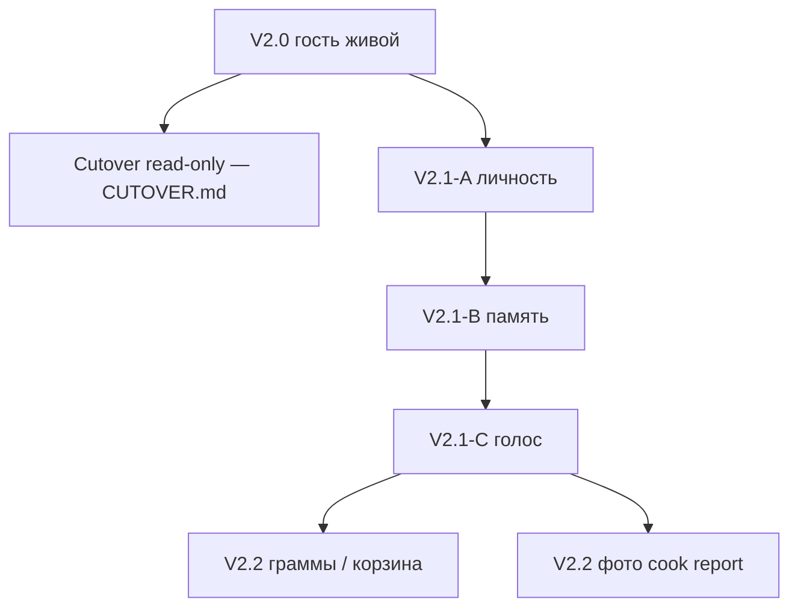

# Аккаунты — план разработки V2.1 / V2.2

Статус: **принято в канон 2026-09-07** (чат: ТЗ по черновику). Хозяин этапов и инвариантов этого слоя. Поля — [DATA-MODEL.md](DATA-MODEL.md). HTTP — [API.md](API.md). Экраны — [UX-PROPOSAL.md](UX-PROPOSAL.md) §13. Числа — [DEFAULTS.md](DEFAULTS.md). ADR — [DECISIONS.md](DECISIONS.md) DEC-025. Задача сессии — [../CURRENT_SPRINT.md](../CURRENT_SPRINT.md): **не кодить**, пока спринт не про аккаунты.

Первый публичный cutover — по-прежнему **read-only гость** ([CUTOVER.md](CUTOVER.md)). Этот план — следующий релиз после живой книги, не вместо неё.

---

## 0. Что взять из ТЗ, что нет

ТЗ человека (чат 2026-09-07) совпадает с черновиком по продукту. В канон вошло почти всё. Ниже — только расхождения, чтобы реализатор не копировал ORM-сниппет ТЗ буквально.

| ТЗ | Решение | Зачем |
|----|---------|--------|
| Гость первичен, ISR без PII, 152-ФЗ, российская почта, passwordless, CSRF, без JWT | **как в ТЗ** | уже PLAN / ARCHITECTURE / HUMAN |
| Слои A → B → C, затем V2.2 граммы и фото | **как в ТЗ** | |
| Избранное, готовил, кладовка-факт, оценка, комментарий, жалоба | **как в ТЗ** | четыре сущности, не один «лайк» |
| `otp_code` в БД открытым текстом | **нет** — только хеш (как DEFAULTS) | письмо знает код, база — нет |
| Идентичность рецепта = `recipe_slug` | **нет** — `FK Recipe`; в URL по-прежнему slug | slug в API, id в таблице |
| Неавторизованный доступ → `401` | **нет** — мутации `403`; `GET …/me/` для гостя **`200`** `{authenticated: false}` | гидрация ISR не должна выглядеть ошибкой |
| Кнопка «Кладовка» на карточке рецепта (блок 13) | **нет** | путаница с «У меня»; кладовка — калькулятор и `/account/pantry` |
| Модалка входа как равноправный экран | **не обязательна** в A; канон — страница `/login?next=` | меньше состояний |
| Домен `vk.com` и «почтовые системы» сверх TLD | **нет** — TLD `.ru` / `.su` / `.рф` + denylist зарубежных хостов | HUMAN 6.3: российские **почтовые домены** |
| Колонка `photo` «про запас» | **нет** — *позже*, V2.2 | DATA-MODEL не резервирует пустые поля |
| `PUT /api/pantry/` как склад с граммами | **нет в V2.1** — тот же URL, только факт наличия | граммы — V2.2 |
| Письмо синхронно в запросе (Mailpit) | **да в A** | Celery — с фото, не «заодно» |
| Кастомный `User` (email = логин) | **да**, `AUTH_USER_MODEL`; контент из ETL, суперюзера создать заново | см. §4 |

---

## 1. Инварианты

1. **Гость умеет готовить.** Книга, калькулятор, «У меня», cook mode, справочник — без входа. Вход нужен, чтобы **сохранить** или **написать**.
2. **ISR/SSG рецепта не содержит личности.** Публичное тело без избранного, оценки, заметок, текстов комментариев, счётчиков «приготовили N». Это клиентский `/api/` после гидрации. Исключение: `community_confirmed` на `Recipe` — редкий флаг, можно в SSR; смена 2→3 — revalidate slug.
3. **Четыре факта не склеивать:** избранное ≠ готовил ≠ оценка ≠ комментарий.
4. **«У меня» ≠ кладовка.** Якорь на карточке масштабирует это блюдо. Кладовка — набор канонов/`have_group` для калькулятора.
5. **GET по ссылке из письма не логинит и не сжигает токен.** Вход — POST кнопки или OTP.
6. **Шапка D+.** Пять пунктов, включая «На неделю» (DEC-026). «Войти» — служебный хром справа. Шестой вкладки в таббаре нет.
7. **Без JWT, CORS, сессий в Redis, Next `app/api`.** Сессия Django в Postgres. Same-origin `/api/`.

Не цель слоя: стена логина, публичные профили, пользовательские рецепты, план меню, граммы как в трекере калорий, Госуслуги, телефон, зарубежная почта.

---

## 2. Зависимости и порядок

- Код A/B/C **не начинать**, пока CURRENT_SPRINT не про аккаунты (явная фраза в чате).
- A можно поднять локально до cutover; на первый прод аккаунты не обязаны ехать.
- Юрист 152/149/406 не закрыт. Код следует этому плану; тексты согласий — заглушка «позже правит юрист», кнопка удаления аккаунта есть сразу.
- Postbox / SPF в проде — до **боевого** входа, не до локального Mailpit.
- Волны рецептов и оверлеи **не** блокируют A: аккаунты вешаются на `Recipe.id`.

---

## 3. Спринты

Каждый спринт сам по себе катится на `:8080`. Гостевой TESTING (A1–A22, E1–E24) после каждого — зелёный.

### V2.1-A — личность

Инфра и вход. Без избранного ещё можно: иначе нельзя проверить письмо.

| # | Сделать |
|---|---------|
| A1 | Приложение `apps.accounts`, `AUTH_USER_MODEL`, миграции. Модели `User`, `AuthToken` — [DATA-MODEL.md](DATA-MODEL.md). |
| A2 | Mailpit в compose. Django `EMAIL_*` на него. В проде Postbox — не этот спринт. |
| A3 | Валидатор почты DEFAULTS. Отказ: «Для входа используются только почтовые адреса в российских доменах». |
| A4 | `POST /api/auth/request-code/` — письмо: 6-значный OTP + ссылка `/login/confirm?token=`. В БД только хеши. TTL 15 мин. Лимит писем. |
| A5 | Страницы `/login`, `/login/confirm`. GET confirm **не** логинит. POST `magic-login` или `verify-code` — сессия, редирект `next`. |
| A6 | 5 неверных OTP → токен мёртв. CSRF на всех мутациях. |
| A7 | Шапка: «Войти» / буква почты → `/account`. Выход POST. |
| A8 | `/account`: почта, выход, «Удалить аккаунт» (подтверждение). Обезличивание DATA-MODEL. |
| A9 | `GET /api/auth/me/` и `GET /api/auth/csrf/`. Админка: пользователь, `is_trusted` только staff. |

**Готово, когда:** гость как раньше; российская почта входит через OTP и через POST со страницы письма; GET ссылки не создаёт сессию; зарубежная почта отвергнута с той же фразой; удаление аккаунта работает; Mailpit показывает письмо.

**Не делать в A:** избранное, комментарии, Celery, MinIO, пятый таб, JWT.

### V2.1-B — память

| # | Сделать |
|---|---------|
| B1 | `Favorite`, `CookReport`, `PantryItem`. |
| B2 | Карточка: «В избранное». Сетка книги: иконка. Гость → `/login?next=`. |
| B3 | `/account/favorites` — недавно сверху. Снятие с карточки и из кабинета. |
| B4 | «Я это приготовил»: карточка и экран «Готово!» cook mode. Не авто при закрытии. Повтор = новая строка. Вариант, посуда, опционально `scale_ratio`, личная заметка. |
| B5 | `/account/cooked`. Себе сразу. V2.1 без фото: `status=approved` сразу. |
| B6 | Кладовка: `GET`/`PUT /api/pantry/` — каноны и `have_group`, без граммов. Калькулятор вошедшего **подставляет** склад; URL `have=` жив. Кнопка **«Сохранить в кладовку»**, не автосейв. `/account/pantry`. |
| B7 | `GET /api/recipes/<slug>/me/` — избранное / последний свой отчёт (гидрация). Гость: `200` `{authenticated: false}`. |

**Готово, когда:** избранное переживает сессию; калькулятор после logout снова живёт на `have=` в URL; «У меня» на карточке склад не пишет; cook mode без отчёта закрывается как сейчас.

**Не делать в B:** оценки, комментарии, граммы, влияние избранного на rank калькулятора.

### V2.1-C — голос

| # | Сделать |
|---|---------|
| C1 | `RecipeRating`, `RecipeComment`, `Complaint`. `Recipe.community_confirmed` обновляет сервис, не ETL и не агент. |
| C2 | Оценка 1–5, одна на пару user×recipe, без обязательного «готовил». Плашка среднего **только при ≥3**. |
| C3 | Комментарии plaintext, без веток, max DEFAULTS. Подпись «Участник · дата». Первые 5 — `pending`. Дальше auto, стоп-слово → `pending`. Свой можно удалить. |
| C4 | `GET /api/recipes/<slug>/comments/` — только `approved`. `GET /api/recipes/<slug>/engagement/` — счётчики без PII. Не класть в ISR HTML. |
| C5 | Жалоба на комментарий и **отдельный** тип «ошибка в рецепте». Django Admin: очереди комментариев, жалоб, стоп-слова. |
| C6 | `community_confirmed`, если ≥3 **разных** пользователей с approved cook report. `is_trusted` → вес 2× в калькуляторе, не `editorial_tested`. |
| C7 | Карточка: блок 13 (избранное, я приготовил) и блок 14 (оценка, комментарии) **после** cook mode / копии ссылки. Не рядом с «Осторожно». |

**Готово, когда:** новый комментарий не пересобирает ISR рецепта; гость читает approved и не пишет; первые 5 висит в админке; три отчёта разных людей ставят `community_confirmed`.

**Не делать в C:** фото, ник, треды, markdown, LLM-модерация.

### V2.2 — не этот план целиком

Отдельный канон, когда дойдут. Здесь только отсечка:

- граммы, срок, корзина покупок;
- фото к cook report: MinIO РФ + Celery + карантин; без фото отчёт V2.1 уже жив;
- поле `photo` не создавать в миграциях V2.1.

---

## 4. Пользователь Django

`AUTH_USER_MODEL = "accounts.User"`: email как логин, `PermissionsMixin`, без пароля как способа входа (unusable password). Парольный логин Django не предлагать в UI.

Локальная БД уже с `auth.User` (суперюзер админки). Смена модели — **один раз** в A: том Postgres можно пересоздать, контент снова из `import_v1` / `import_draft`. Суперюзера — `createsuperuser` на email `.ru`. Не писать data-миграцию «переложи админов», если проще снести том.

`is_trusted` ставит только staff в админке.

---

## 5. Почта

Локально Mailpit, хост из compose на loopback для UI писем (порт — DEFAULTS / compose, не публиковать в проде).

Письмо:

- код из 6 цифр;
- ссылка `https://<host>/login/confirm?token=<raw>`;
- TTL 15 минут в тексте.

Токен ссылки и OTP — разные случайные значения, оба только хеш в `AuthToken`. Сырой token в query **только** чтобы отрисовать hidden field; логин — POST.

---

## 6. Экраны — указатель

Канон жестов: [UX-PROPOSAL.md](UX-PROPOSAL.md) §13. Кратко: `/login`, `/login/confirm`, `/account`, `/account/favorites`, `/account/cooked`, `/account/pantry`. Карточка — пункты 13–14. Cook mode — кнопка на «Готово!», не в шагах.

---

## 7. Риски

- Смена `AUTH_USER_MODEL` на живой БД без пересоздания тома — сломать админку. В A заложить «том пересоздаём».
- ISR + счётчики в HTML → вечный revalidate. Счётчики только `/engagement/`.
- Автосейв кладовки сотрёт склад при эксперименте на калькуляторе — поэтому кнопка.
- Юрист не смотрел: не обещать «соответствует 152-ФЗ» в UI; обещать «можно удалить аккаунт».
- Стоп-слова слишком широкие задушат «соль» / «жарить» — список короткий, маты и спам, правит человек.

---

## 8. Как стартовать код

1. Человек: «стартуй аккаунты» / спринт V2.1-A в CURRENT_SPRINT.
2. Реализатор читает этот файл → DATA-MODEL → API → UX-PROPOSAL §13 → TESTING (блок V2.1).
3. Не копировать Python из старого ТЗ в чате: хозяин полей — DATA-MODEL.
4. После A — зелёный гостевой TESTING, потом B, потом C. Не A+C в одном PR.
