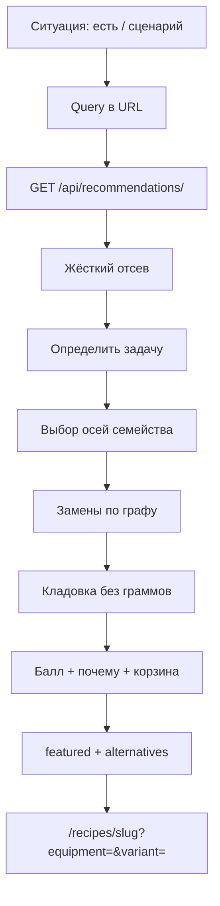

# Калькулятор — как устроен

Экран `/calculator`. Имя в UI временное ([HUMAN.md](HUMAN.md) 3.15). Контракт HTTP — [API.md](API.md). Коды — [VOCAB.md](VOCAB.md). Веса — [DEFAULTS.md](DEFAULTS.md). Экраны — [UX-PROPOSAL.md](UX-PROPOSAL.md) §5.

Это не «У меня» на карточке рецепта. Это не книга `/recipes`. Граммы кладовки, срок и корзина — не здесь (V2.2). Вошедший (V2.1-B): стартовый набор из `/api/pantry/`, кнопка «Сохранить в кладовку», не автосейв. Гость по-прежнему только `have=` в URL.

## Зачем

Человек сообщает **ситуацию**: что есть дома и что сейчас важнее (быстро, без покупок, духовка…). Django **собирает** конкретную версию блюда: оси семейства + допустимые замены + чего не хватает. Next рисует вопрос и одно главное решение, не анкету VOCAB.

Ответ — не «какие семейства подошли», а **CookingSolution**: этот slug, эти оси, эти замены, эта покупка, это «почему». На экране — одно featured и 2–3 альтернативы с человеческими подписями.

Ссылка в адресной строке — готовый подбор. Шаринг только с `/calculator?…`. Query на `/` — редирект сюда.

## Экран

Первый слой — задача, не словарь:

| Подпись | Query | Смысл |
|---------|-------|--------|
| Что есть дома | `have=` после резолва текста | каноны без граммов |
| Грубые чипы | `have_group=` | курица / мясо / рыба / овощи / крупы / яйца / молочное / другое. Выбранная группа — **карточка** с вложенным уточнением (мясо → вид → отруб). Несколько групп — несколько карточек, не общий ряд. Сверху «Выбрано» с путём. |
| Что сейчас важнее | `intent=` | `fast` `pantry` `easy` `batch` `light` `oven` — вес, не обязательный фильтр способа |
| Ещё условия | `without=`, `equipment=` | аллергены и посуда **по запросу**, не с первого экрана |

Оси `protein_base` / `cook_method` / `cuts` живые в query (шаринг, «ещё условия», книга), на первый экран калькулятора **не** вываливаются. VOCAB — движок.

Пустой `/calculator` — только вопрос, не 43 карточки.

Минут 15/30 в чипах нет, пока ranking не читает `time_profile` (у ETL V1 поле null; у принятого оверлея — есть). «Быстро» пока = вес способа и числа шагов.

Выдача: **Я бы приготовил** + почему + «Ещё варианты». Не сетка каталога. Не `Score 87`.

Пусто после запроса: «Ничего не подошло — снимите ограничение» + ссылка в книгу. Не «скоро».

## Кто что делает

| Слой | Файл | Роль |
|------|------|------|
| Вопрос и URL | `CalculatorAsk.tsx`, `lib/filters.ts` | текст, грубые чипы, сценарии; клик = ссылка |
| Страница | `app/calculator/page.tsx` | SSR, `force-dynamic`; пустой вход без выдачи |
| Запрос | `lib/api.ts` → `fetchRecommendations` | `have`, `have_group`, `intent`, ещё условия |
| Отсев | `views.py` `_apply_filters` | ORM: published + оси |
| Сборка решения | `services/solve.py` | оси, pantry, замены, intent, featured |
| Резолв текста | `services/pantry.py` | алиасы; не LLM |
| Чиповые баллы | `services/ranking.py` | совпадения с выбранными осями, если заданы |
| Замены | `SubstitutionRule` + сид | не LLM |
| Словари | `constants.py` ≡ VOCAB | неизвестный код оси / `have` / `have_group` / `intent` → **400** |

Каталог `GET /api/recipes/` те же фильтры осей **плюс** поиск `q`. Каталог `have=` не принимает.

## Правила query

Ключи: `protein_base`, `cook_method`, `dish_type`, `equipment`, `cuts`, `without`, `have`, `have_group`, `intent`. Повторы или CSV — несколько значений.

- Один ключ, несколько кодов: **OR**. Птица или говядина. Курица или лук.
- Разные ключи: **AND**. И духовка.
- Чужой код оси / аллергена / `have` / `have_group` / `intent`: **400**, не тихий skip.
- `have=` — канон покупки **или** русский алиас. `свинина` → группа свинины, не шея. Голое «масло» не резолвится. Текст с пробелами режется; длинные фразы («растительное масло») — целиком.
- `have_group=` раскрывается в каноны группы, если человек не уточнил конкретные `have=` из этой группы. Родитель `meat` не раскрывается, если уже выбран вид (`beef` / `pork` / `lamb` / `offal`).
- Если в `have=` два и больше конкретных продукта и есть блюдо, которое **берёт их все**, оно идёт первым (`из всего выбранного`), даже если надо докупить ещё 1–2.
- `intent=` — вес (сковорода для `fast`, духовка для `oven`…), не обязательный `cook_method=`.
- Нет query: API отдаёт все published (витрина это использует). Экран `/calculator` без query **не** рисует карточки.

Пример: `?have_group=chicken&intent=fast` или `?have=chicken_thighs&have=onion`.

Смена основы **сбрасывает** `cuts`. `have` при смене основы не сбрасывается. Пагинации нет.

## Четыре слоя

### 1. Жёсткий отсев (не балл)

1. Не `published`.
2. Основа задана — `protein_base` не из списка.
3. Способ задан — нет совпадения с базой **и** нет варианта посуды с `has_delta` и `cook_method_override` в списке.
4. Посуда задана — код у базы **или** у варианта `axis=equipment` с `has_delta`.
5. Отруб задан — код ∈ `Recipe.allowed_cuts`.
6. «Без чего» — в аллергенах карточки есть `contains` **или** `unknown`. `may_contain` не отсекает.

Аллергены карточки — **худший случай** по addon-дельтам, без строк `optional`.

Одна карточка = одно семейство (один slug). Несколько осей не плодят строки выдачи.

`have=` **не** отсекает блюда, которые **используют** продукт из «Есть»: нехватка остального — в корзину «почти» / «лучше», не в пустую выдачу. Блюдо, которое «Есть» не берёт (стейк при фарше, взбитое масло), на доску не попадает. Если ни одно published блюдо не использует «Есть» — `featured: null`, empty state, не «купите другой отруб».

### 2. Найти основу

Те же семейства, что прошли отсев.

### 3. Адаптировать

Для семейства перебираются комбинации: база; каждый `axis=equipment` с `has_delta`; каждый `axis=addon` с `has_delta`. `has_delta=false` состав не меняет — в перебор не входит.

Оставляются комбинации, которые удовлетворяют выбранным способу и посуде. Берётся **одна** лучшая: меньше докупать, выше балл, при равенстве — база без аддона.

Сборка display — `assemble` (база ⊕ addon ⊕ equipment). Energy в query нет.

Затем граф замен: для каждой **ядровой** строки, которой нет в `have`, ищется правило `from → to` с `to` в кладовке, `forbidden=false`, `quality` ≥ порога DEFAULTS. Контекст рецепта бьёт глобальное правило. Замена «сливки → вода» с низким quality не проходит.

Щепотка и чайная ложка специй не докупаются. «По вкусу» у ядра (стейк) — докупается. `PANTRY_ASSUMED` всегда в шкафу. `PANTRY_COMMON` не блокирует («желательно паприка»). Составные ETL-id вроде `water_or_stock` — не товары.

Без `have=` слой кладовки молчит: substitutions и shopping пустые.

### 4. Оценить

Чиповые баллы — как раньше (основа / способ / посуда / тип / editorial), если оси заданы в «ещё условиях». Плюс:

- покрытие ядра из `have` (совпала **строка** состава, не «та же основа белка»: фарш ≠ стейк);
- бонус «есть …» только если ядровая строка из `have` реально закрыта;
- если в `have=` ≥2 конкретных продукта и блюдо берёт **все** — оно первое, «из всего выбранного»;
- штраф за докупку и за каждую замену (трение);
- `intent`: быстро / из имеющегося / духовка / полегче / проще / на несколько дней.

Пользователю **не** показывать `score`. Только `why[]`.

После ранжирования Django собирает **доску**: одно `featured` и до трёх `alternatives` с подписями «Быстрее» / «Проще» / «На несколько дней» / «Ещё вариант». Альтернативы — из той же доски (блюда, которые используют «Есть»), не случайный короткий `no_cook`. Корзины `now` / `almost` / `best` остаются в JSON для отладки; экран их сеткой не рисует.

Корзины при непустом `have=`:

| Корзина | Когда |
|---------|--------|
| `now` | ядро закрыто **и** хотя бы один продукт из «Есть» в блюде |
| `almost` | докупить 1–2 **и** блюдо использует «Есть» |
| `best` | использует «Есть», но докупить больше 2 (лимит) |

Одно решение — в одной корзине. Сначала блюда из **всех** явных `have=`, если такие есть; иначе сейчас → почти → лучше среди использующих «Есть». Экран берёт featured из этого порядка, не рисует три сетки. Рецепты с `pantry_hits=0` в корзины доски не входят.

Без `have=` корзины в JSON пустые; `featured` всё равно собирается из ranked results (сценарий без кладовки).

`dish_type` `sauce` и `preserve` — заготовки (взбитое масло, ароматное масло, бастинг), не ужин. На доске их нет, пока есть обычное блюдо (`main` `soup` `breakfast` `side`…). Если в выдаче только заготовки (человек спросил `dish_type=sauce`) — тогда они остаются. «Быстрее» без кладовки не должно открываться взбитым маслом.

## Что видит человек

Не каталог карточек. Одно главное решение: название, «всё основное есть» или «нужно докупить …», замены словами, **почему**, кнопка «Приготовить». Рядом 2–3 варианта с человеческой подписью.

`score` не показывать. Минуты не выдумывать.

Клик — `/recipes/<slug>?equipment=&variant=` с осями решения. Состав на странице совпадает с обещанием карточки.

## Чего калькулятор не делает

- Не масштабирует граммы. «У меня» — на рецепте.
- Не ищет по названию (`q` только у книги).
- Не считает граммы кладовки и не ведёт корзину покупок.
- Не угадывает отрубы из title. Не выдумывает дельты у 43.
- Не вызывает LLM. Next не считает балл.
- Не показывает весь VOCAB первым экраном. Не врёт минутами 15/30.

## Как проверить

`/calculator` — поле, грубые чипы, сценарии; нет рядов «Основа / Способ / Посуда / Есть · мясо».  
`/calculator?have_group=chicken&intent=fast` — одно главное решение, не 43 карточки.  
`/calculator?have=chicken_thighs&have=onion` — «можно приготовить сейчас» или «докупить» словами, не процент.  
`/calculator?protein_base=poultry&cook_method=oven` (шаринг / ещё условия) — ссылка уже с осью посуды, если матч через неё.  
`/calculator?have=beef_mince&have=onion` — если есть блюдо из обоих, оно первое.  
`/calculator` — Мясо открывает карточку; Говядина — вложенную с путём «Мясо → Говядина»; вырезка/рёбра/мякоть внутри. Две группы — две карточки. «Выбрано» показывает путь.  
Неизвестный `have`: API 400. Чужой `intent`: 400.  
`GET /api/ingredients/?text=курица` — каноны курицы, не 400.
