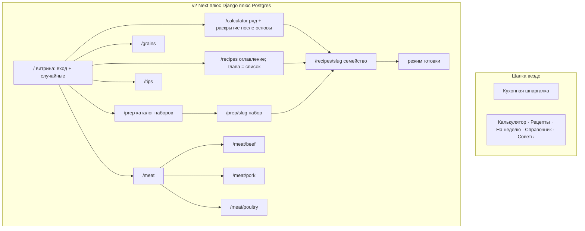

# UX 2.0 — предложение каркаса

Статус: **принято с правками §9** (2026-09-05). Каркас шапки и URL — **D+**. Имя в UI пока **«Калькулятор»** (HUMAN 3.15). `v2/preview/` не референс.

Не CSS, не HTML-разметка, не поля API. Экраны и жесты. Стек — [ARCHITECTURE.md](ARCHITECTURE.md). Данные — [DATA-MODEL.md](DATA-MODEL.md). Словари — [VOCAB.md](VOCAB.md). Ответы — [HUMAN.md](HUMAN.md) §2–§3 и §9.

2.0 — не второй JSON-сайт. Код только папка [`v2/`](../): Next.js читает Django, Django держит PostgreSQL. Корневой `data/*.json` — сырьё **одного** ETL; в браузере V2 файлов рецептов нет.

Живой V1 (корень, http://127.0.0.1:3456) — продукт, который переносим жестами, не стеком.

## Что остаётся от D+ / что ломаем

**Остаётся.** Шапка: **Калькулятор · Рецепты · На неделю · Справочник · Советы** (пятый пункт — слой заготовок, HUMAN 11.6; запрет D+ на пятый таб был для среза книги). URL: `/`, `/calculator`, `/recipes`, `/recipes/<slug>`, `/prep`, `/prep/<slug>`, `/grains`, `/meat`, `/meat/beef|pork|poultry`, `/tips`. Главная — витрина: короткий вход, случайные рецепты и советы. Справочник и советы без «скоро». Печать не в этом спринте. Масштаб и ранг — Django. «У меня» только на рецепте. Кнопки витрины на «На неделю» не обязательны.

**Ломаем относительно среза 1 и старого D+.** Книга больше не копия калькулятора. Главная `/` больше не копия калькулятора. `/recipes` — оглавление по **смыслу** (мясо, птица, овощи, рыба, гарниры, завтраки, десерты). Калькулятор — **задача** (что есть + что важнее), не полотно VOCAB. На рецепте два отдельных переключателя: добавки и посуда. Вариации — не `
` с абзацами. Заметки — список, не простыня. Cook mode на ≥769px — две колонки. Шапка и таббар — **иконка + подпись**. Favicon как у V1.

---

## Рекомендация коротко

**D+ плюс семейства.** Один каркас. Книга ≠ калькулятор. Главная ≠ калькулятор. Одно блюдо = один slug; добавки и посуда — два переключателя, не один список чипов. Калькулятор: ситуация → минимум уточнений → CookingSolution (DEC-018). Один спринт паритета уже сдан; этот экран — не анкета VOCAB.

---

## 0. Стек экранов (чтобы не спутать с V1)

| | V1 (`archive/v1/`, архив) | V2 (`v2/` только) |
|--|-------------------------|-------------------|
| Отдача | статический HTML + `fetch` JSON | Next SSR → Django `/api/` → PostgreSQL |
| Рецепт | `recipe.html?id=` | `/recipes/<slug>`, тело из БД, ISR публичного HTML |
| Справочник | `data/grains.json` и т.д. | `content_documents` в Postgres |
| Подбор | нет | Django domain service, веса в DEFAULTS |
| После cutover | JSON в архив | dual-write нет |

Экраны ниже — маршруты Next. Данные — из API/БД. Число рецептов V1 — [DEFAULTS.md](DEFAULTS.md).

---

## 1. Что есть в V1 (жесты, не архитектура)

Снято с живого сайта (корень, :3456) и его JSON. Проверено: главная и `recipe.html?id=` (стейк на сковороде, лопатка в рукаве, голяшки) отдают 200.

| Факт | Число / жест |
|------|----------------|
| Рецептов сейчас | см. DEFAULTS «Каталог V1» |
| `tried` | **0** |
| `servings` | ни у одного |
| «У меня» | якорь — первый масштабируемый ингредиент с г/мл (или кг/л); ±, поле, **г↔кг / мл↔л**, factor, имя якоря, «в рецепте N», сброс, hint что таймеры не масштабируются |
| Крупы / мясо / советы | 21 / 20+14+27 / 10 секций |
| Калькулятор, печать, фото | нет |
| Вариации | заголовок + абзац; состав списка **не** меняется |
| Заметки | один blob |

Десктоп V1 — шесть хеш-вкладок. Телефон — Справочник | Рецепты | Советы + сетка 2×2. Рецепт: «У меня», cook mode, копия ссылки. Карточка мяса: readout °C и **Ошибка:** — образец для «Осторожно».

### Cook mode V1 — раскладка 1280 и 390

Оверлей на весь экран (`position: fixed; inset: 0`), шапка: закрыть · название · «не гасить экран». Нижняя мобильная полоска скрыта.

**Фазы:** setup → шаги → «Готово».

Setup: «Когда начнёте?» (**Сейчас** / **Запланировать** + datetime); блок **Заранее** (разморозка, холодильник, маринад…) если в рецепте есть prep; сводка «N шагов / N с таймером»; **Начать готовку**; при prep — **Только напоминания**.

Шаги: прогресс «Шаг k из n»; крупная карточка текущего текста; таймер (старт / пауза / сброс) и **±** длительности, пока таймер не бежит (шаг ± зависит от длины: 30 с / 1 мин / 5 мин); чекбокс «Шаг выполнен»; Назад / Далее. Обзор **Все шаги** — `
` внизу, прыжок по пункту.

**1280 px.** Тот же один столбец, что на телефоне: карточка тянется на ширину оверлея, лента шагов спрятана в «Все шаги». Двух колонок в CSS V1 нет. На широком столе пустые поля по бокам, читать можно, оглавление не видно без клика.

**390 px.** Тот же столбец, уже: крупный текст шага, огромные цифры таймера, кнопки на всю ширину. Обзор тоже в `
`. Это нормальный телефонный wizard.

**V2 срез сейчас:** нет setup, нет «Заранее», нет обзора, нет ± таймера; на десктопе тот же телефонный столбец. Это регресс, не канон.

---

## 2. Каркас D+ (шапка и URL не менять)

Имя в UI **пока:** «Калькулятор» (десктоп и таббар). Постоянное имя — HUMAN 3.15; URL `/calculator` не обязан совпасть с будущей фразой.

### Десктоп

`Кухонная шпаргалка`  иконка+`Калькулятор`  иконка+`Рецепты`  иконка+`На неделю`  иконка+`Справочник`  иконка+`Советы`

Пятый пункт — слой заготовок (HUMAN 11.6), не «Войти». Иконки — таблица в §8. Логотип ведёт на `/`. «Калькулятор» ведёт на `/calculator`. «На неделю» ведёт на `/prep`. На справочнике вторая полоска только с содержимым из БД: Крупы · Говядина · Свинина · Птица. Рыба — живой фильтр в калькуляторе и глава книги, не пустая страница-гид.

Активный пункт: `/calculator` → Калькулятор; `/recipes*` → Рецепты; `/prep*` → На неделю; `/grains|/meat*` → Справочник; `/tips` → Советы. На `/` активен бренд, не пункт шапки.

Favicon — тот же файл, что у V1 (`assets/favicon.svg`): **копия** в `v2/frontend/public`, корень не трогать.

### Мобиле (≤768px)

Пять пунктов таббара — те же лейблы, с иконками (§8). «Калькулятор» и «На неделю» длинноваты в пять колонок — терпим. В справочнике сетка 2×2. Рецепт: ← Рецепты | Справка | Режим готовки (иконки — §8). Из слота набора «← Рецепты» можно вести на `/prep/<slug>`.

### Главная `/` — витрина, не калькулятор

Не каталог, не оглавление гидов и **не копия** `/calculator`. Подбор живёт на `/calculator`.

1. Eyebrow и заголовок **Кухонная шпаргалка**. Короткий лид. Две кнопки: **Подобрать блюдо** → `/calculator`, **Все рецепты** → `/recipes`.
2. **Рецепты** — случайные 6 семейств из каталога на **каждый** запрос (главная `force-dynamic`, не ISR). Без строки «почему». Ссылка **Все рецепты** на оглавление книги.
3. **Советы** — случайные 6 пунктов из гида. Карточка ведёт на `/tips#tip-<item.id>` конкретного пункта (`06-01`), не только секции. Ссылка **Все советы**.
4. Низ футера: Крупы · Говядина · Свинина · Птица · Советы шеф-поваров · **Все рецепты**. Без «скоро».

Пусто: «Рецепты пока не загружены» / «Пока нет советов». Не подменять книгой и не рисовать полный ряд фильтров.

Канон шаринга подбора: `/calculator?…`. Если на `/` есть query — редирект на `/calculator` с тем же query.

### Сравнение с A/B/C

A и C нет. B близко по разделам. D+ = та же навигация; главная = витрина (вход + лучшие), не калькулятор; книга — оглавление по смысловым разделам, не те же чипы.

---

## 3. Экраны среза

Next-маршруты. Источник — Postgres через Django, после ETL из V1.

| URL | Цель | Главный сценарий | Пусто |
|-----|------|------------------|--------|
| `/` | Продукт: вход + витрина | Кнопка в калькулятор; случайные рецепты и советы | «Рецепты пока не загружены» / «Пока нет советов» |
| `/calculator` | Подбор и шаринг | Что есть + сценарий; одно главное решение + альтернативы | «Ничего не подошло» + ссылка в книгу |
| `/grains` | Сварить крупу | Строка/карточка из справочника | empty-state |
| `/meat` | Выбрать белок с гидом | Говядина / свинина / птица | Нет плиток без записи в БД |
| `/meat/beef` `/meat/pork` `/meat/poultry` | Отруб → °C | Карточки как V1 | empty-state |
| `/tips` | Справочник советов шеф-поваров | Поиск + чипы секций и `kind`; masonry-плитка (`hint` + бейджи), без дыр по рядам. Раскрытие поверх сетки, слот не двигает соседей. Одна открыта. | empty-state |
| `/recipes` | Книга | Оглавление по основе → сразу карточки главы; способ и посуда — фильтры | Глава без рецептов не рисуется; поиск — «Ничего не найдено» |
| `/recipes/<slug>` | Одно семейство | Два переключателя (добавки и посуда) → «У меня» → cook mode | 404 |
| `/recipes/<slug>?prep=&day=&meal=` | Блюдо из набора | Контейнеры, глагол mode, шаги слота или alternative, cook mode | нет слота → не открывать (ошибка API, не книга «с нуля») |
| `/prep` | Наборы на неделю | Каталог published, порядок как API | «Наборы пока не загружены». Не «скоро» |
| `/prep/<slug>` | Один набор | Шапка = ценность (минуты, сборки/доготовки, экономия). Три вкладки: **Что купить** · **Подготовить в воскресенье** · **Блюда на неделю**. `?servings=` | 404 |
| `/login` | Войти | почта → письмо; OTP на этой странице | зарубежный домен — фраза DEFAULTS |
| `/login/confirm` | Подтвердить вход | GET рисует кнопку POST; сам GET не логинит | токен протух — «запросите письмо снова» |
| `/account` | Полка | избранное / готовил / кладовка / выход / удалить | гость → `/login?next=/account` |
| `/account/favorites` | Избранное | сетка семейств, новые сверху | «Пока ничего не сохранили» |
| `/account/cooked` | Готовил | лента отчётов | «Отметьте блюдо после готовки» |
| `/account/pantry` | Кладовка | те же чипы, что калькулятор, без граммов | пустой набор |
| `recipe.html?id=` | Старый вход | страница Next читает `id`, redirect на `/recipes/<slug>` | 404 |

Гостевой срез **без** `/login` и `/account`. Когда CURRENT_SPRINT про V2.1-A — маршруты выше обязательны. Печать, пустые гиды, граммы кладовки — по-прежнему не здесь. `/api/pantry/` в V2.1 — факт наличия, не склад с остатками. `have=` в URL калькулятора живёт всегда.

Калькулятор не вываливает VOCAB: основа/способ/посуда/отрубы — книга и «Ещё условия». Ниша с рецептами после ETL — живой код в движке; нулевая выдача — empty-state, не «скоро». Пустых гидов `/seafood` `/vegetables` не заводить. Коды отрубов в proposal не выдумывать.

Переключатель калоража на рецепте — **после этого спринта** (поле в модели можно заложить с волнами). Срез показывает только обычный профиль.

Волна +100 — после кода сайта и «стартуй волну 1». Весь текущий каталог V1 уходит в Postgres сразу.

---

## 4. Книга `/recipes`

Вопрос экрана: **что есть в книге**, не «что есть дома». Шапка — тот же декоративный натюрморт, что на других хабах (не фото блюда).

Первый уровень — **смысловые разделы**, не алфавит кодов. Сначала роль на столе (завтрак / гарнир / десерт), иначе основа блюда. Яичница — в Завтраках, не в «другом». Не кладовка, не «Есть».

| Раздел | Что входит |
|--------|------------|
| Мясо | `protein_base` `beef` `pork` `lamb` `offal`, если это не завтрак/гарнир/десерт |
| Птица | `poultry` |
| Овощи | `vegetables` `mushrooms` `legumes` `vegetarian` как основное, не гарнир |
| Рыба и морепродукты | `fish_*` и `seafood` |
| Гарниры | `dish_type=side` |
| Завтраки | `dish_type=breakfast` (яичница, омлет, сырники, каша…) |
| Десерты | `dish_type=dessert` |
| Другое | соусы и заготовки (`sauce` `preserve` `drink`) и то, что не легло в разделы выше |

Рецепт в **одном** разделе. Коды VOCAB внутри раздела — узкий фильтр «Основа», не плитки оглавления.

### Как листать

1. `/recipes` без выбора — **оглавление**: плитки разделов с числом семейств, в порядке таблицы выше. Раздел с нулём после ETL **не показывается**. Не писать «скоро». Не сортировать плитки по алфавиту.
2. Клик по разделу — **сразу все семейства этой группы**. Не прятать список за основой, способом и посудой. URL: `?chapter=breakfasts` (и т.п.). Старый `?protein_base=beef` по-прежнему открывает сетку (раздел мясо, фильтр говядина).
3. Если в разделе несколько кодов основы — фильтр **Основа** над списком. Способ и посуда — тоже фильтры (только те, что есть в главе). Не выбраны — видна вся глава. Один клик сужает; повтор снимает. Посуду не спрашивать, если в главе она одна.
4. Карточка = **семейство** (один slug). Не четыре карточки «с грибами / с пармезаном / с кабачками».

Поиск по названию и составу — всегда на экране. Запрос даёт **плоский** список семейств по всей книге, с крошками «Завтраки · духовка». Сброс поиска возвращает в оглавление.

Стейт пути по книге — в адресе, чтобы шарить главу. Ссылка «Калькулятор» — в подбор; обратно — «Книга».

Пустая ветка (способ без рецептов после фильтра «без молока»): «В этой главе ничего — снимите ограничение или выберите другую основу». Не подменять выдачей калькулятора.

«Без чего» в книге **можно** как узкий отсев аллергена над уже выбранной главой, не как первый ряд. Не ставить сюда «Есть» / кладовку.

---

## 5. Калькулятор `/calculator`

Вопрос экрана: **что приготовить из этой ситуации**. Не каталог. Не анкета VOCAB. Не граммы кладовки. Книга — «найти рецепт» (поиск + оглавление по смысловым разделам, внутри главы сразу список). Калькулятор и книга **не** должны выглядеть одинаково.

Как считает движок — [CALCULATOR.md](CALCULATOR.md). ADR: DEC-017 (сборка) и DEC-018 (задача, не фильтр). Граммы — V2.2.

Три слоя:

1. **Ситуация.** Поле «что есть дома» и/или грубые чипы (курица, мясо, рыба, овощи, крупы, яйца) + сценарии: быстро, из того что есть, проще, на несколько дней, полегче, духовка.
2. **Уточнения по нужде.** «Ещё условия»: без чего, посуда. Не спрашивать кастрюлю, если человек не открыл этот слой. Не показывать все отрубы говядины.
3. **Движок.** Сам мапит VOCAB, выбирает оси, пробует замены, оценивает покупки и трение, отдаёт 1 главное решение + 2–3 альтернативы с **почему**.

Пустой вход — только вопрос, не 43 карточки.

Не прятать старое полотно в аккордеоны и считать задачу решённой. Сценарий — не фильтр `cook_method` (кроме явного выбора в «ещё условиях» или `intent=oven` как вес). Минут 15/30 нет, пока в рецепте нет времени.

### Выдача

Не сетка каталога.

**Я бы приготовил** — одно блюдо: что уже есть / что докупить, замены словами, почему, «Приготовить».

**Ещё варианты** — Быстрее / Проще / На несколько дней, не Score.

Клик открывает **ту же** ось (`?equipment=&variant=`). Пусто: «Ничего не подошло — снимите ограничение» + ссылка в книгу.

Слова, которых **нет** на калькуляторе: «У меня», «Точнее», граммы, процент совпадения, полотно «Основа · Способ · Посуда · Есть · мясо и птица…». Список покупок с граммами — **V2.2**.

HUMAN 9.4 (углубление отрубов) живёт в **книге** и в разметке рецепта, не на первом экране калькулятора.

---

## 6. Страница рецепта `/recipes/<slug>`

SSR из БД. На 390px не прятать осторожно, источник, «У меня», cook mode.

Порядок блока:

1. Назад к книге (крошки: Рецепты / основа / способ / название).
2. Название. «Готовил сам» только при проверенной готовке редакцией.
3. Словарные теги (основа, способ, тип блюда). Посуда — если известна.
4. **Осторожно** при high-risk.
5. Аллергены. `unknown` ≠ «нет».
6. Лид, источник, блок **Заранее** (prep), как в V1.
7. Два **отдельных** переключателя над ингредиентами, **не** внизу абзацем и **не** в одном списке чипов (9.1 + 9.2):
   - **Добавки:** Базовый · С грибами · С пармезаном · С кабачками. Один slug. Клик сразу меняет список, шаги, аллергены, заметки. Нет добавок — ряда нет.
   - **Посуда:** Кастрюля · Духовка · Казан. Меняет шаги и нюансы (время, крышка, жидкость). Не второй slug. Если способ тоже сдвигается (варка vs духовка) — всё ещё это семейство. Нет второй посуды — ряда нет.
   Не мешать «с грибами» и «в казане» в одну линейку.
8. Над составом, если в рецепте есть строки шкафа (вода, соль, сахар, перец, растительное масло, лимон, уксус, ложка муки/крахмала — [RECIPE.md](RECIPE.md) § «Шкаф»): блок **Из шкафа:** названия через запятую, без граммов. Пустой блок не рисовать. Эти строки не дублировать в списке закупки ниже.
9. Ингредиенты базы + **«У меня»** как V1. Порции — только если в строке есть servings. У `to_taste` / `pinch` справа иконка с тултипом «КБЖУ для этой строки не считается», только у жирного/сладкого (мёд, масло, кунжут). Соль, перец, паприка — без иконки. Соль и перец из шкафа в этом списке не повторять.
10. Чипы калоража **Обычный · Полегче · Сытнее** остаются, если варианты написаны. Нет — ряда чипов нет. Чипы — редакционный `energy_profile`, не ккал на чипе. Чип `light`/`rich` меняет состав — тот же пайплайн КБЖУ.
   После «У меня» (не вместо чипов) блок **«КБЖУ ориентировочно»**: на рецепт (текущий масштаб); на 100 г продуктов до готовки; на 100 г готового — **только если** `per_100g_cooked` не null (`yield_kind=estimated` → подпись «оценка»); на порцию — только если есть `servings`. `incomplete` — заметная пометка «неполный расчёт», не мелкая серая. Дисклеймер: «Ориентировочно. Зависит от продукта и способа приготовления.» Без ТР ТС. Не диета, не соседство с «Осторожно» как medical.
11. Шаги текущего варианта/посуды.
12. **Заметки** списком (§6.2).
13. **Режим готовки** · **Копировать ссылку**.
14. **Себе** (V2.1, после гидрации `/me/`): **В избранное** / **В избранном**; **Я приготовил**. Гость — те же подписи, клик на `/login?next=` текущей карточки (с `variant` и `equipment`). Кнопки **«Кладовка» здесь нет** (кладовка — калькулятор и `/account/pantry`). Не соседствовать с «Осторожно».
15. **Голос** (V2.1): среднее оценок только если ≥3; форма оценки и комментария — вошедшему; список approved. Подпись комментария: «Участник · дата». Гость список читает, форма — «Чтобы написать, войдите».

Адрес страницы помнит выбранный вариант и посуду, чтобы ссылка открывала тот же состав. Счёт количеств — Django (якорь), Next не считает степень. ISR HTML **не** содержит пунктов 14–15 и текстов комментариев.

### 6.1. «У меня» — паритет с V1

Только на рецепте. Нет якоря — блока нет (стейк без граммов как в V1).

Жест:

- подпись **У меня**;
- − / поле / + ;
- переключатель **г↔кг** или **мл↔л**, если якорь весовой/объёмный;
- factor рядом с подписью (когда не 1);
- строка: **имя якоря · в рецепте N единица**;
- **Сброс**;
- hint: «Время готовки не пересчитывается — ориентируйтесь на шаги и подстройте таймеры в режиме готовки».

Первый HTML — базовые количества. Клиент считает «У меня» сразу (DEC-021), без паузы и без «Обновляем количества». Полную перезагрузку на каждый ввод не делать.

Не тащить в калькулятор.

### 6.2. Заметки — список (принято 9.6)

В UI в этом спринте — список пунктов (карточка или строка): **заголовок + текст**. Не одна простыня. Не прятать в `
`.

Экран живёт с **0…10**: ноль — секции нет; один — один пункт (у ETL V1 часто blob без заголовка: показать как есть, без выдуманного названия).

Тексты пишут **когда делают рецепт** (волна или переработка семейства). Отдельным проходом по 43 не добивать. Квоты **3 / 6 / 10** — ворота [RECIPE.md](RECIPE.md) для новых волн, не UI-счётчик.

### 6.3. Посуда — имена для человека (принято 9.2)

Коды не предлагать (HUMAN 2.5 пуст, модель сама заведёт enum). На экране — бытовые имена. Набор для фильтра и отдельного переключателя:

| В UI | Когда показывать |
|------|------------------|
| Сковорода | жарка, соте, соус в сковороде |
| Кастрюля | варка, суп на плите |
| Духовка | форма / противень / рукав — одно имя «Духовка», не плодить гид |
| Казан | плов, томление в казане |
| Гриль | мангал, решётка |
| Пароварка | пар |
| Мультиварка | та же еда, другая посуда; способ внутри — тушение или варка |
| Аэрогриль | если в каталоге появится |
| Без нагрева | салат, сборка |

Не путать с способом: тушение в кастрюле и тушение в казане — одна глава «тушение», две посуды. Пустых гидов под каждую посуду нет.

Мультиварка и микроволновка — посуда, не новый пункт шапки.

### 6.4. Из набора `?prep=`

Не смешивать с книжным телом. Query `prep` + `day` + `meal` (или однозначный `prep` без дня, если slug в наборе один раз).

На странице: назад к `/prep/<slug>`; глагол из `mode` (Собрать / Доготовить / Разогреть); номера контейнеров; чипы замен (`alternatives[].label`) — тот же слот, другой slug; шаги из слота или выбранной alternative. Ингредиенты книги и переключатели осей в этом режиме не главные — будни про боксы. «У меня» якоря карточки нет: масштаб порций набора (`servings` kit).

Пусто / нет слота: не подменять телом «с нуля».

Cook mode: жесты книги; шаги слота/замены; в setup — разморозка, если у бокса `thaw_before_day` ≤ день слота.

### 6.5. Наборы `/prep` и `/prep/<slug>`

**Каталог `/prep`.** Карточки published наборов (порядок API). Пусто: «Наборы пока не загружены». Не «скоро». Не демо.

**Набор.** Шапка = ценность, не вкладка: **сколько длится подготовка в воскресенье** (`t_sunday_wall_min`); **экономия за неделю** против тех же 14 приёмов с нуля (`scratch − вс актив − будни`); **средний ориентир ккал на блюдо** (приложение считает по основным рецептам слотов, не по companion — это внутренний счёт, на экране не объяснять жаргоном). Рядом в `summary` — человеческая ценность: воскресенье один раз собираем основу, будни 10–20 минут, не надо каждый день доставать нож и решать, что готовить. Не показывать сборки/доготовки/разогревы и «N из M заготовок», если числа не помогают выбрать набор. Нет числа — не показывать, не выдумывать.

Три вкладки с иконкой + подпись: **Что купить** (`shopping-basket`) · **Подготовить в воскресенье** (`refrigerator`) · **Блюда на неделю** (`utensils`). Чипы порций на странице: **1 / 2 / 4** (`?servings=`; база `servings_base=2`, без query — две). Рядом, **до вкладок**: переключатель **Без вчерашнего** (`?no_leftover=1`), если в наборе есть `reheat`. Это выбор плана, не фильтр сетки: закупка, воскресенье и слоты считаются заново. Граммы списка и боксов линейны, число контейнеров не менять. Тексты шагов не пересчитывать. Подпись переключателя: механика (*Блюдо на один приём; вместо разогрева — другое из набора. Меняет закупку и воскресенье.*) **плюс цена плана** — `+N быстрых блюд, +M позиций к закупке` (N = число заменённых `reheat`, M = уникальные `shopping_add` после слияния). Без цены переключатель выглядит магической кнопкой.

Воскресенье: **рецепт подготовки** (`weekend_timeline`: intro + шаги как у блюда, без меток `00:00`) + таблица «куда разложить». Intro — **две колонки** (≥640px, на узком столбиком): слева список посуды, справа кратко что сегодня сделать. Не простыня «Понадобится: …». Банки в шкафу отдельно, не «ещё один бокс». Не список того, что сегодня не делать. Охлаждение большого объёма — шаг шкалы: неглубокая ёмкость / баня → в хранение, не «сразу в морозилку» и не «когда перестало парить». Подробности по заготовкам — в `
`, не вторым набором рецептов. Граф компонентов на этом срезе не обязателен.

Сетка слотов: день × обед/ужин. На карточке — **название тарелки** и состав (котлеты с гречкой и салатом), не жаргон «соус вс, перья 8 мин». У дня, которому нужна оттайка, **над слотами** фраза, что достать: мясо и жидкость — «С вечера …», нарезанные овощи — «Утром …». Не один шаблон на все боксы дня и не заставлять искать только в таблице. Для ~1 л жидкости подпись отражает 24–36 ч. Клик — карточка с `?prep=`. **Без вчерашнего**: слот-источник готовится на один приём (`feeds_slots=1`); слот `reheat` становится **другим** опубликованным блюдом из `no_leftover` — карточка каталога, которой **нет** среди 14 основных slug набора (не перестановка уже стоящей ячейки, не дыра, не «Пропуск»). Боксы этого kit и/или `shopping_add`. Не солвер: замену пишет набор.

---

## 7. Режим готовки

Снять с V1, усилить десктоп. Wake Lock оставить.

**Вход:** кнопка на рецепте и пункт таббара рецепта. Оверлей на весь экран.

**Setup (и телефон, и стол):** Сейчас / Запланировать; **Заранее**, если prep есть; сводка шагов и таймеров; Начать готовку; при prep — Только напоминания.

**Шаги:** крупный текущий текст; таймер старт/пауза/сброс и **±** длительности, пока не запущен; «Шаг выполнен»; Назад / Далее; температуры шага, если есть.

**≥769 px — две колонки, не прятать ленту в `
`:**

| Левая | Правая |
|-------|--------|
| Текущий шаг, таймер, ±, чекбокс, Назад/Далее | Оглавление всех шагов: текущий выделен, выполненные зачёркнуты, клик = прыжок |

Setup на широком: слева «когда начнёте» и старт, справа список «Заранее» (если пуст — сводка шагов).

**≤768 px:** пошаговый столбец как V1; обзор **Все шаги** в `
` под навигацией — в срезе V2 его не хватает, вернуть.

Конец: «Готово!» и закрыть. Рядом, не вместо закрытия: **«Я это приготовил»** (V2.1; гость → логин с `next` на карточку). Не ставить отчёт автоматически при закрытии оверлея.

Уведомления prep/таймера — как в V1 по возможности браузера; нет разрешения — тост на экране.

Cook mode показывает шаги **текущих** добавок и посуды — или шаги слота набора, если открыто с `prep=`. Смена рядов — на странице рецепта до входа в режим; внутри режима переключатели не дублировать (легко сбить таймер).

---

## 8. Меню и иконки (принято 9.8)

Состав пунктов D+: книга + калькулятор + **На неделю** (HUMAN 11.6). «Войти» по-прежнему не пункт таббара. И **шапка десктопа**, и **таббар** — **иконка + подпись**, не голый текст и не иконка без лейбла. Не цветные эмодзи. Stroke 1, `currentColor`, viewBox 24. Источник: спрайт V1 `archive/v1/assets/images/icons.svg` + недостающие с [lucide.dev](https://lucide.dev/icons/) (Stroke width = 1px). Копия спрайта в `v2/frontend`; **архивный спрайт не править «заодно»**.

### Шапка и таббар

| Пункт | Лейбл | `aria-label` | Символ спрайта | Есть в V1 спрайте | Добрать с Lucide |
|-------|--------|----------------|----------------|-------------------|------------------|
| Калькулятор | Калькулятор | Калькулятор | `icon-list-filter` | нет | [list-filter](https://lucide.dev/icons/list-filter) |
| Рецепты | Рецепты | Рецепты | `icon-book-open-text` | да | — |
| На неделю | На неделю | На неделю | `icon-refrigerator` | да | — |
| Справочник | Справка (таббар) / Справочник (шапка) | Справочник | `icon-wheat` | да | — |
| Советы | Советы | Советы шеф-поваров | `icon-chef-hat` | да | — |

На десктопе и в таббаре — символ слева от текста, один и тот же набор. Срез 1: шапка без иконок — это регресс, не канон.

Справа в шапке, **не** пункт основной навигации и **не** пункт таббара: гость — «Войти» → `/login`; вошедший — первая буква почты → `/account`. На 320px буква/«Войти» живут в шапке страницы над таббаром. Пятый таб — «На неделю», не вход.

Не брать `icon-calculator`: имя пункта временное (3.15), фильтр переживёт переименование.

### Таббар рецепта (≤768)

| Пункт | Символ | В спрайте | Добрать |
|-------|--------|-----------|---------|
| ← Рецепты | `icon-book-open-text` | да | — |
| Справка | `icon-wheat` | да | — |
| Режим готовки | `icon-timer` | да | — |

### Уже в спрайте, нужны режиму готовки и странице

`icon-x`, `icon-sun`, `icon-play`, `icon-timer`, `icon-circle-check`, `icon-check`, `icon-chevron-down`. Не дублировать Lucide-React, если символ уже в спрайте.

### Справочник (вторая полоска / сетка 2×2)

Как V1: Крупы `icon-wheat`, Говядина `icon-beef`, Свинина `icon-ham`, Птица `icon-drumstick`. Эти символы уже в спрайте.

---

## 9. Что взять с V1 / что сломать

**Взять жесты:** «У меня» целиком (г↔кг, factor, имя якоря, сброс, hint про таймеры); cook mode setup + Заранее + ± таймера + обзор шагов + Wake Lock; таблица круп / карточки мяса; карточки советов (`hint` / `explanation`, не аккордеон секций); карточка без фото; токены `global.css`; Lucide 1px / спрайт; 301 со старого URL; empty-state; favicon.

**Сломать / не тащить:** хеш-вкладки и шесть табов; 85 свободных тегов как основа фильтра; дефолт «сразу плоский каталог»; главная = калькулятор; Google Fonts; JSON в рантайме; «скоро»; печать; текстовые вариации, которые не меняют состав; один столбец cook mode на десктопе; подпись «Есть» у основы блюда; книга = калькулятор; полотно VOCAB на `/calculator`.

**Срез 1 (факт, не цель):** вариации как абзацы; «У меня» без г↔кг и factor; cook mode без setup/prep/обзора/±; шапка без иконок; нет favicon; оба экрана — одни чипы.

---

## 10. Печать

Кнопка → Ctrl+P и `@media print`. В V1 нет. **Не в этом спринте.**

---

## 11. Риски

- Каталог V1 не заполняет новые оси: у большинства семейств один способ и одна посуда; переключатель посуды часто скрыт. Не делать вид, что 43 рецепта уже «в казане иначе».
- Пустые ниши основы (море, субпродукты, овощи, грибы, бобовые) после ETL: в книге главы нет, в калькуляторе чип даёт empty-state. Не «скоро».
- «Есть» vs основа: если оставить старую подпись, человек снова увидит кладовку. Только **Основа**.
- Раскрытие после основы без разметки в данных = пустой ряд: **не рисовать**. Не выдумывать US-карту отрубов и не заводить коды в VOCAB из UX.
- Смешать «с грибами» и «в казане» в один список — запрещено 9.2; в вёрстке два ряда.
- «Докупить» в граммах — V2.2. Простой `have=` без граммов — DEC-017. Первый экран калькулятора — задача, не VOCAB (DEC-018).
- Заметки V1 — blob: список из одного пункта выглядит бедно рядом с квотой «6». Это честно; тексты — только когда делают рецепт.
- Cook mode две колонки на ≥769: на 769–900 правая лента узкая — короткие строки оглавления (первая фраза шага), не полный абзац.
- «Калькулятор» в таббаре на 320px жмётся — ок, пока имя временное.
- Главная `/` — каждый запрос новая случайная шестёрка рецептов и советов (`force-dynamic`); query на `/` уходит на `/calculator`.
- Не тащить `fetch('data/recipes/...')` в Next.
- Вошедший на калькуляторе: чипы из кладовки как стартовое; **«Сохранить в кладовку»** явно. Автосейв нет. Logout не ломает `have=` в URL.

---

## 12. Решения человека и открытое

| # | Решение |
|---|---------|
| Каркас | **D+** — шапка и URL без смены состава |
| Главная | Витрина: короткий вход, случайные рецепты и советы; не копия калькулятора |
| Имя | **пока «Калькулятор»**, постоянное — HUMAN 3.15 |
| Печать | Нет |
| «Скоро» | Нет |
| Калораж | Переключатель на рецепте после этого спринта; HUMAN 2.13 |
| Овощи/море в фильтрах | Когда появятся рецепты; гиды не пустые |
| 9.1 Вариации | **принято** — одно семейство, один slug, дельты, переключатель добавок сразу меняет состав |
| 9.2 Посуда | **принято** — **отдельный** переключатель рядом с добавками; не второй slug; не один список с «с грибами» |
| 9.3 Докупить / граммы | **уточнено** — простой `have=` в спринте 3; граммы и корзина V2.2 |
| 9.4 Раскрытие после основы | **книга** — глава сразу со списком; способ/посуда — фильтры. Отрубы как в РФ, когда появятся в данных. Калькулятор больше не анкета VOCAB (DEC-018) |
| Калькулятор UI | **принято чатом 2026-09-05** — задача → уточнения → featured; не полотно фильтров |
| 9.5 Книга | **принято** — первый уровень основа блюда; **уточнено 2026-09-06** — после главы сразу все рецепты; **уточнено 2026-09-07** — оглавление: мясо / птица / овощи / рыба и морепродукты / гарниры / завтраки / десерты / другое |
| 9.6 Заметки | **принято** — UI списка в спринте; тексты когда делают рецепт, не проходом по 43 |
| 9.7 Спринт | **принято** — паритет + семейства + книга≠калькулятор в одном спринте после канона |
| 9.8 Иконки | **принято** — шапка и таббар: иконка + подпись; состав D+ не менять |
| Аккаунт | **принято чатом 2026-09-07** — слой поверх гостя; [ACCOUNTS.md](ACCOUNTS.md); «Войти» не пятый таб; кладовка не на карточке рецепта |

Постоянное имя — одна фраза в HUMAN 3.15. URL `/calculator` можно оставить.

---

## 13. Аккаунт (V2.1)

План: [ACCOUNTS.md](ACCOUNTS.md). Состав пунктов D+ не менять.

Шапка справа: «Войти» / буква почты. Таббар без пятой вкладки.

`/login`: одно поле почты, кнопка «Прислать код», затем поле OTP. `/login/confirm`: «Подтвердить вход» (POST). `next=` — безопасный внутренний путь (карточка, калькулятор, кабинет), не open redirect.

`/account` — оглавление полки (избранное, готовил, кладовка), выход, удалить аккаунт с подтверждением. Карточки в избранном = семейство как в книге, ссылка с запомненными осями если были.

На сетке книги — иконка избранного после гидрации, не второй заголовок.
