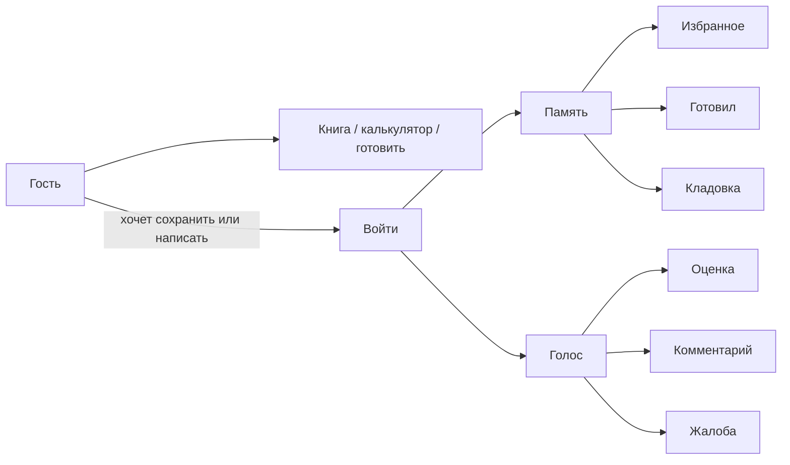

# Черновик: авторизованный пользователь

Статус: **перенесён в канон 2026-09-07.** Не править этот файл — править [ACCOUNTS.md](../ACCOUNTS.md), [DATA-MODEL.md](../DATA-MODEL.md), [API.md](../API.md), [UX-PROPOSAL.md](../UX-PROPOSAL.md) §13, [PLAN.md](../PLAN.md), [DECISIONS.md](../DECISIONS.md) DEC-025. Задача сессии: [../../CURRENT_SPRINT.md](../../CURRENT_SPRINT.md).

Тело ниже — архив до переноса. Разбор ТЗ (что взяли / отвергли) — канон ACCOUNTS §0.

---

Гость уже может всё, ради чего сайт существует: книга, калькулятор, карточка, «У меня», режим готовки, справочник. Этот файл — про **необязательный второй слой**: помнить человека между визитами и дать ему голос на карточке.

Канон гостя не отменяет: [UX-PROPOSAL.md](../UX-PROPOSAL.md) (D+), [ARCHITECTURE.md](../ARCHITECTURE.md), [PLAN.md](../PLAN.md) §6, числа [DEFAULTS.md](../DEFAULTS.md). Юрист 152/149/406 ещё не смотрел ([HUMAN.md](../HUMAN.md) §6).

---

## 0. Как читать

| Роль | Что делать |
|------|------------|
| Человек | Править логику, ответить на вопросы §12. Пустая ячейка ≠ «да». |
| Агент-реализатор | **Не кодить** из этого файла. После «да, делаем аккаунты» — сначала канон, потом спринт. |
| Агент UX | Не ломать четыре пункта шапки D+. Не рисовать пятый таб «Кабинет». |
| Агент рецептов | Игнорировать. `editorial_tested` по-прежнему только человек. |

После принятия: разнести по хозяевам (не оставлять правду только здесь).

| Куда | Что уходит |
|------|------------|
| PLAN | этапы V2.1 / V2.2, что не делать |
| UX-PROPOSAL | экраны `/login`, `/account`, жесты на карточке |
| DATA-MODEL + API | таблицы и HTTP |
| ARCHITECTURE | Mailpit / Postbox / Celery (письма), позже MinIO (фото) |
| DEFAULTS | TTL, премодерация, порог `community_confirmed` — уже лежат там |
| DECISIONS | ADR после явной фразы человека |
| HUMAN | ответы §12 |
| TESTING | приёмка гостя без регресса + сценарии входа |

---

## 1. Зачем аккаунт

Сайт остаётся шпаргалкой, не соцсетью и не дневником диеты.

Гость решает задачу **сейчас**. Аккаунт решает задачу **потом**:

1. Не потерять блюдо, которое понравилось (**избранное**).
2. Помнить, что уже стояло на столе (**готовил**).
3. Не набирать «что есть дома» заново (**кладовка**).
4. Оставить след на карточке: оценку, короткий текст, позже фото (**голос**).

Если фича не помогает ни в одном из четырёх — её нет в этом слое.

Не цель: стена логина, подписки, лента друзей, пользовательские рецепты, план питания на неделю, граммы как в MyFitnessPal.

---

## 2. Гость не ломаем

| Сейчас без входа | После аккаунтов |
|------------------|-----------------|
| Книга, калькулятор, карточка, cook mode, справочник | то же, те же URL |
| `have=` в адресе калькулятора | по-прежнему работает и шарится |
| «У меня» на карточке | по-прежнему локальный масштаб, не склад |
| ISR публичного HTML рецепта | то же; личные кнопки — после гидрации с `/api/` |

Вход **не** спрашивают, чтобы:

- открыть рецепт, книгу, калькулятор, справочник;
- смасштабировать «У меня»;
- войти в режим готовки и дойти до «Готово!»;
- скопировать ссылку.

Вход спрашивают, чтобы **сохранить** (избранное, готовил, кладовку) или **написать** (оценка, комментарий, жалоба).

На карточке гость видит чужие **опубликованные** комментарии и факт «готовили N раз», если решим это показывать. Писать — после входа.

---

## 3. Что уже решено (не переигрывать без причины)

Собрано из HUMAN / PLAN / DEFAULTS / ARCHITECTURE. Это не новые идеи.

**Вход**

- Только российские почтовые домены. Gmail и зарубежное — нет.
- Госуслуги и телефон — нет.
- Django-сессия в Postgres. Не JWT, не CORS, не сессии в Redis.
- GET по ссылке из письма **не** логинит и **не** сжигает токен. Вход — POST кнопки на сайте или OTP.
- Magic link / OTP: TTL **15 минут**, одноразовый, в БД только хеш. OTP — **6** цифр.
- SPF/DKIM/DMARC — до боевого входа. Postbox в проде — когда дойдём (HUMAN 7.5 «позже»).
- Cookie-дисклеймер без Метрики — да.
- Юрист ещё не смотрел: продуктовый выбор не заменяет заключение.

**Голос**

- Комментарии: plaintext, **без веток**.
- Премодерация первых **5** опубликованных комментариев пользователя; стоп-слова; жалоба человеку.
- Оценка: **1–5**, одна на пару пользователь×рецепт, менять можно.
- Фото **только** к «я приготовил», карантин на worker. Не фото блюда в каталоге.

**Доверие**

- `editorial_tested` ставит человек (модератор или роль `trusted`). Агент не ставит.
- `community_confirmed`: **3** одобренных cook report от **разных** пользователей.
- Вес trusted cook report в калькуляторе — **2×** обычного, не заменяет редакционную готовку.

**Инфра, которой ещё нет в compose**

- Письма: локально Mailpit, в проде Postbox.
- Фото: MinIO / object storage РФ, Celery worker. Не в первом публичном cutover (read-only книга).
- ClamAV на VPS 8 ГБ — нет.

**Каркас экранов**

- Четыре пункта шапки/таббара D+ **не менять**. `/account` и `/login` в срезе специально отложены, не «забыты».
- ISR — только публичное тело. Персональные блоки — клиентский `/api/` после гидрации.

---

## 4. Слои: что за чем

PLAN уже режет так: **V2.1** — почта, оценки, комментарии; **V2.2** — граммы кладовки, покупки, фото. HUMAN 3.9 склеивает «граммы / корзина / аккаунт» в V2.2 — это про **глубокую кладовку**, не запрет войти раньше. Рабочая гипотеза (подтвердить в §12):

| Слой | Когда | Что получает человек | Инфра сверх среза |
|------|-------|----------------------|-------------------|
| **0. Гость** | сейчас / первый прод | весь продукт | нет |
| **A. Личность** | V2.1 начало | войти, выйти, сессия | почта, CSRF-мутации |
| **B. Память** | V2.1 | избранное, «готовил» без фото, кладовка как факт наличия | те же |
| **C. Голос** | V2.1 | оценка, комментарий, жалоба | очередь модерации |
| **D. Кладовка глубже** | V2.2 | граммы, срок, список покупок | плотность канонов уже есть |
| **E. Медиа** | V2.2 | фото к «я приготовил» | MinIO + worker + карантин |

Слой B имеет смысл **сразу после A**: иначе аккаунт — только форма входа. Слой C можно включить тем же релизом или следующим, но модель закладывать вместе: cook report кормит и «готовил», и `community_confirmed`.

Не смешивать в один спринт A+D+E. Письма и фото — разная инфра и разный риск 152-ФЗ.

---

## 5. Сущности (смысл, не схема БД)

Четыре разных факта. Не склеивать в одну кнопку «лайк».

| Сущность | Что значит | Публично? | Гость |
|----------|------------|-----------|--------|
| **Избранное** | «хочу найти потом» | нет, только себе | нет, просим войти |
| **Готовил** (`cook report`) | «это блюдо уже стояло на столе» (дата, вариант, посуда) | счётчик — да, если включим; список — нет | чтение счётчика да; запись нет |
| **Оценка** | 1–5 по вкусу/результату | среднее — открытый вопрос §12 | чтение да; запись нет |
| **Комментарий** | короткий plaintext про готовку | да, после модерации | чтение да; запись нет |
| **Кладовка** | «что есть дома» тем же словарём, что `have=` | нет | URL по-прежнему; аккаунт — чтобы не терять |
| **Жалоба** | на комментарий или на ошибку в рецепте | нет | на комментарий — после входа; на рецепт — почта как сейчас |

«У меня» на карточке **не** кладовка: это масштаб текущего блюда (якорь). Кладовка живёт в калькуляторе и в кабинете.

Фото — поле cook report, не отдельная галерея и не обложка карточки в книге.

---

## 6. Сценарии

### 6.1. Войти

1. «Войти» в шапке (не пятый пункт навигации) или с карточки: «Чтобы сохранить — войдите».
2. Почта. Если домен не российский — отказ с понятной фразой, не «ошибка сервера».
3. Письмо: ссылка **и** код из 6 цифр.
4. Человек открывает ссылку → страница подтверждения → жмёт кнопку (POST) **или** вводит OTP на `/login`.
5. Сессия. Редирект туда, откуда пришёл (карточка, калькулятор), не на пустой кабинет, если был глубокий URL.

Выход — явная кнопка в кабинете. «Забыть меня» (удалить аккаунт и следы) — заложить в V2.1 как обязательный жест 152-ФЗ, даже до заключения юриста: кнопка есть, текст дисклеймера правит юрист.

Повторный вход с той же почты — тот же человек, не второй аккаунт.

### 6.2. Избранное

На карточке рецепта — контрол «В избранное» / «В избранном». На сетке книги — тот же жест, мельче (иконка), не второй заголовок карточки.

Список: `/account` → раздел «Избранное». Порядок: недавно добавленные сверху. Пусто: «Пока ничего не сохранили — откройте книгу».

Не влияет на выдачу калькулятора и не рисует отдельную главу в оглавлении книги. Это полка человека, не редакционный раздел.

Снять из списка — с той же кнопки на карточке или крестиком в кабинете.

### 6.3. Готовил

Не ставить автоматически при закрытии режима готовки: закрыл — не значит съел.

Два входа, один смысл:

- конец cook mode, после «Готово!»: **«Я это приготовил»** (можно пропустить);
- на карточке, вне режима: то же.

Пишем: slug, выбранные добавки и посуда, дата, опционально короткая личная заметка (не комментарий на сайте). Масштаб «У меня» / порции — по желанию (открытый вопрос §12).

Повторно то же блюдо — новая запись, не перезапись. Человек готовит борщ дважды.

В кабинете — лента «Готовил» по дате. С карточки — «Вы готовили: 12 марта» (себе), без публичного ника.

Публичный счётчик «приготовили N раз» — только **одобренные** отчёты, если включим в §12. Не сырые клики.

Три одобренных отчёта разных людей → `community_confirmed` на рецепте (DEFAULTS). Trusted-роль весит больше в калькуляторе, флаг редакции не ставит.

### 6.4. Кладовка

Гость: как сейчас, `have=` / `have_group=` в URL, без граммов.

Вошедший, V2.1: тот же набор канонов **привязан к человеку**. Калькулятор при открытии подставляет сохранённое, URL по-прежнему можно шарить (снимок момента, не «мой склад»). Человек правит чипы — «Сохранить в кладовку» или автосохранение (вопрос §12).

Не подмешивать кладовку в книгу и не переименовывать фильтр «Основа» обратно в «Есть».

V2.2: граммы и срок годности; сравнение «хватает / не хватает»; список покупок с граммами. Тогда появится `/api/pantry/` как склад. До этого эндпоинта склада нет: достаточно «список канонов пользователя».

«У меня» на рецепте в кладовку **не** пишется: «у меня 800 г голяшки **для этого** блюда» ≠ «в холодильнике всегда голяшка».

### 6.5. Оценка и комментарий

На карточке, **ниже** заметок редакции, не рядом с «Осторожно» и не вместо КБЖУ.

- Оценка: 1–5, свою можно сменить. Без обязательного текста.
- Комментарий: одно поле, без ответа на чужой. Не форум.
- Первые пять опубликованных комментариев пользователя ждут человека. Дальше — стоп-слова; сработало — снова очередь.
- «Пожаловаться» на комментарий → человеку. Свой комментарий можно удалить.
- Жалоба на ошибку рецепта (температура, шаг, аллерген) — не комментарий, а отдельный короткий отчёт редакции. Иначе модерация смешает «мне не вкусно» и «в шаге 3 опасно».

Гость комментарии читает. Пустой блок: секции нет, не «будьте первым» как маркетинг.

Фото в комментарии нет. Картинка — только у cook report в V2.2.

### 6.6. Калькулятор и кабинет

Вошедший открывает `/calculator` — кладовка уже заполнена (слой B). Сценарий («быстро», «из запасов») **не** обязан запоминаться: ситуация сегодня другая. Если запоминать — последний `intent=` как подсказка, не как стена.

Шаринг калькулятора остаётся URL: ссылка описывает ситуацию, не «мой аккаунт».

---

## 7. Экраны (набросок, не правка D+)

Четыре пункта **Калькулятор · Рецепты · Справочник · Советы** остаются. Аккаунт — **служебный хром справа** в шапке: «Войти» / короткая почта или инициал. На таббаре телефона **не** пятая вкладка: вход с шапки страницы или с жеста «сохранить».

| URL | Кто | Зачем |
|-----|-----|--------|
| `/login` | все | почта, OTP, «письмо отправлено» |
| `/login/confirm` | из письма | кнопка POST «Войти»; GET сам по себе ничего не даёт |
| `/account` | вошедший | полка: избранное, готовил, кладовка, выход, удалить аккаунт |
| `/account/favorites` | вошедший | список семейств (те же карточки, что в книге) |
| `/account/cooked` | вошедший | лента отчётов |
| `/account/pantry` | вошедший | редактор «что есть» без граммов (V2.1) |
| `/recipes/<slug>` | все | + избранное, + «я приготовил», + оценка/комментарии |

Не заводить `/users/<id>` и публичные профили. Человек на сайте — почта для входа, не персонаж.

Гость на `/account` → `/login?next=/account`.

Рецепт в избранном или в «готовил» ведёт на **тот же** `/recipes/<slug>?variant=&equipment=`, что запомнили.

---

## 8. Карточка рецепта — куда встаёт

Порядок публичного блока UX-PROPOSAL §6 **не переставлять**. Личное и голос — **после** режима готовки / копирования ссылки, перед тем как страница кончилась:

13. **Себе:** В избранное · Я приготовил (если вошёл — состояние; если нет — те же слова, по клику `/login?next=`).
14. **Голос:** оценка, список комментариев, форма (форма только вошедшему).
15. Не соседствовать с «Осторожно». Не маскировать `unknown` аллергена пользовательским «у меня всё ок».

В cook mode внутри шагов этих контролов нет (сбить таймер легко). Только экран «Готово!».

---

## 9. Данные и HTTP — набросок

Не поля канона. Чтобы при переносе в DATA-MODEL не начать с нуля.

Новое приложение Django, например `accounts` (не размазывать по `recipes`):

- пользователь: почта, `is_trusted`, согласие, `deleted_at`;
- одноразовый токен входа (хеш, TTL, unused);
- избранное: unique (user, recipe);
- cook report: user, recipe, variant, equipment, cooked_at, note, status (`pending` / `approved` / `rejected`), позже photo;
- оценка: unique (user, recipe), 1–5;
- комментарий: body, status, очередь премодерации;
- жалоба: на comment или на recipe, plaintext, статус;
- кладовка V2.1: набор `canonical_id` (+ `have_group` как в калькуляторе); граммы — колонка **позже**, не выдумывать 0.

Мутации — POST/DELETE `/api/…` того же origin, CSRF-cookie. GET списка избранного — только своей сессией, не чужой id в URL.

Публичная карточка рецепта может отдавать агрегаты (`comments_count`, `cooked_count`, `rating_avg`) в уже существующем GET, без PII. Тело комментариев — отдельный GET, чтобы ISR рецепта не содержал чужие тексты (или короткий TTL). Точный контракт — в API.md после принятия.

Запреты стека те же: нет Next `app/api`, нет JWT.

---

## 10. Модерация и доверие

| Поток | Кто видит сразу | Кто решает |
|-------|-----------------|------------|
| Избранное, кладовка, личная заметка к «готовил» | только автор | никто, это не публикация |
| Оценка | в среднем, если среднее публичное | антиспам позже; пока одна оценка на рецепт |
| Комментарий, первые 5 | очередь | человек в админке |
| Комментарий после 5 | сразу, если не стоп-слово | стоп-слово → очередь; жалоба → человек |
| Cook report без фото | себе сразу; в счётчик — после approve **или** сразу себе и в счётчик без очереди (вопрос §12) | |
| Cook report с фото (V2.2) | карантин worker | человек |
| Жалоба на рецепт | редакция | человек правит карточку |

Админка Django достаточна для очереди V2.1. Отдельный «постбокс модератора» не делать.

Стоп-слова — список в репо или в БД, правит человек, не LLM.

---

## 11. Явно не в этом слое

- Пятый пункт шапки, бургер «ещё», публичные профили, подписки.
- Пользовательские рецепты и правки канона «с телефона».
- Фото в каталоге, стоки, AI-обложки.
- Граммы кладовки, срок, корзина покупок — V2.2.
- Печать, план меню, календарь, уведомления «пора готовить» на пуш.
- Госуслуги, телефон, зарубежная почта, OAuth Google.
- Runtime LLM для модерации и «умных» замен.
- Стена логина на cook mode.

---

## 12. Вопросы человеку

Ответы сюда или в HUMAN. Пока пусто — слой не канон.

| # | Вопрос | Предложение | Ваш ответ |
|---|--------|-------------|-----------|
| 12.1 | Резать как в таблице §4 (A+B, затем C, D/E в V2.2)? | да; фото и граммы не в первом входе | |
| 12.2 | Публичный счётчик «приготовили N» на карточке? | да, только одобренные отчёты; иначе только себе в кабинете | |
| 12.3 | Публичное среднее оценок? | да, если оценок ≥ 3; иначе не показывать число | |
| 12.4 | Оценка без «я приготовил» разрешена? | да: избранное и оценка без готовки ок; в `community_confirmed` идёт только cook report | |
| 12.5 | Кладовка вошедшего: автосохранение чипов или кнопка «Сохранить»? | кнопка, чтобы случайный чип не затирал склад | |
| 12.6 | Помнить последний `intent=` калькулятора? | нет в V2.1 | |
| 12.7 | Писать в cook report масштаб («У меня» / порции)? | да, опционально | |
| 12.8 | Личная заметка к «готовил» видна только себе? | да, не путать с комментарием | |
| 12.9 | Ник на комментарии? | нет, подпись «гость сайта» слишком голо; **локальная часть почты** не светить. Предложение: «Участник» + дата, без ника до отдельного решения | |
| 12.10 | Cook report без фото в общую статистику сразу или в очередь? | сразу себе; в `community_confirmed` — после 3 разных людей без ручного approve каждого, пока нет фото. С фото (V2.2) — всегда очередь | |
| 12.11 | Избранное на сетке книги или только на карточке семейства? | и там и там, иконка на карточке сетки | |
| 12.12 | Удаление аккаунта в V2.1? | да, сразу: комментарии → «удалено», отчёты анонимизировать, избранное стереть | |
| 12.13 | Первый публичный cutover с аккаунтами или книга без входа, аккаунты следующим релизом? | **книга без входа** (CUTOVER уже так); этот документ — план **после** живого read-only | |

---

## 13. Как превратить в план разработки

Не начинать код из этого файла. Порядок, когда человек сказал «делаем»:

1. Ответы §12 → HUMAN (новый подпункт, не затирая §3.9–3.12).
2. PLAN §6 и таблица этапов: явный порядок A→B→C и отсечка D/E.
3. UX-PROPOSAL: маршруты §7, жест шапки, пункты 13–14 на карточке, экран «Готово!». Состав D+ не трогать.
4. DATA-MODEL + API + TESTING: модели, CSRF-мутации, кейсы «гость по-прежнему готовит».
5. ARCHITECTURE + DEFAULTS: Mailpit в compose, когда спринт про письма; MinIO не поднимать «заодно».
6. ADR в DECISIONS (вход POST, избранное ≠ оценка, кладовка ≠ «У меня»).
7. CURRENT_SPRINT — только после канона, отдельным чатом «стартуй аккаунты» / номер спринта.

Готово к реализации, когда: гость не регрессировал, вход без GET-login, четыре сущности §5 не склеены, шапка D+ на месте, юрист хотя бы знает, что почта российская и удаление аккаунта есть.
