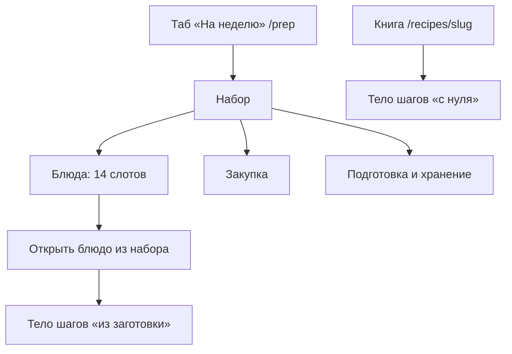

# Черновик: заготовки на неделю

Статус: **продукт слоя.** Канон приложения — DATA-MODEL / API / UX-PROPOSAL. Чаты 2026-09-09. Контент-анализ — по [WEEKLY-PREP-TZ.md](WEEKLY-PREP-TZ.md), не начинать без явной фразы в чате.

---

## 0. Как читать

| Роль | Что делать |
|------|------------|
| Человек | Править логику. Пустое ≠ да. |
| Агент-реализатор приложения | **Не кодить**, пока CURRENT_SPRINT не про этот слой. |
| Агент UX | Срез 2.0 — четыре пункта шапки. **Слой заготовок — пятый таб** (решение 2026-09-09). В UX-PROPOSAL перенести в спринте слоя. |
| Агент рецептов | Не волна JSON. Сначала анализ по ТЗ. Старт: явная фраза в чате. |

**Набор** — комплект на неделю. **Компонент** — полуфабрикат после вс. **С нуля** — тело карточки в книге. **Из заготовки** — второе тело шагов того же slug.

---

## 1. Решения

| Тема | Решение |
|------|---------|
| Неделя | 7 дней × обед + ужин = **14 слотов**. Завтраки и десерты нет. |
| Порции | База **на 2**. На странице набора чипы **1 / 2 / 4**. |
| Кто | **Любой**, без входа и оплаты. Готовые наборы. |
| Сбор калькулятором / оплата | **бэклог.** |
| Полуготовность | **Да**, это заготовка, не блюдо на стол. Сроки и охлаждение — editorial + SAFETY. |
| Будничная карточка | **B:** у одного slug **два тела шагов** — с нуля (книга) и из контейнеров (из набора). Не схлоп первых шагов: протокол вс может не совпасть с началом рецепта. Каждый slug проверять отдельно, часть доработать. |
| Вход | **Пятый таб** шапки и таббара. Запрет D+ был для среза книги/калькулятора, не для этого слоя. Имя в UI — **«На неделю»** (пока). URL `/prep`, `/prep/<slug>`. |
| Повторы | Можно **большую порцию на 2 дня**, если на следующий день вкусно и безопасно. Какие блюда так живут — анализ, не правило «все супы». Второй слот тогда — разогрев, не вторая готовка с нуля. |
| Пилот | **Эксперимент №0** (два kit) — опыт, не витрина. Следующие наборы — по редакционному слою, не копированием kit-1/kit-2. |
| V2.2 | Не блокер закупки: список из состава × масштаб. Граммов кладовки в коде нет. |

---

## 2. Зачем

Один раз на выходных: закупка, нарезка, полуготовность, контейнеры / морозилка. Дальше 14 приёмов по 10–20 минут: достал, собрал, дожарил до целевой температуры.

Ценность — **component meal prep**: одна подготовка даёт разные будничные блюда. Не несколько одинаковых кастрюль и не «ещё 14 рецептов». Набор проектируют как **систему недели** (хранение, охлаждение, разморозка, посуда, честные минуты, повтор боксов), не как пачку текстов: [WEEKLY-PREP-DESIGN.md](../weekly/WEEKLY-PREP-DESIGN.md) §28–40.

Главный критерий: минимум воскресной работы, который создаёт максимум разных быстрых блюд. Книга и калькулятор не отменяются: они по-прежнему «что сейчас». Как собирать неделю: [WEEKLY-PREP-DESIGN.md](../weekly/WEEKLY-PREP-DESIGN.md).

---

## 3. Чем это не является

| Уже есть | Это |
|----------|-----|
| `use_cases=batch` / `intent=batch` | Одно блюдо впрок. Не неделя. |
| `preserve` / `sauce` | Банка или компонент. |
| «Говядина на волокна» | Кандидат в компонент. |
| «План меню» в ACCOUNTS | Не цель аккаунтов. Наборы — отдельный таб. |
| «Докупить» калькулятора | К одному блюду. |

---

## 4. Сценарий среза

1. Таб открывает каталог из двух наборов.
2. Набор: масштаб 2, можно сменить.
3. Шапка набора — ценность (минуты, сборки/доготовки). Три вкладки: **Что купить** · **Подготовить в воскресенье** · **Блюда на неделю**.
4. Из набора — cook mode по `PrepSlot.steps` (или `alternatives[].steps`).
5. Из книги без `prep` — тело **с нуля**. Тот же slug.

---

## 5. Данные (предложение)

1. **Компонент** — нарезка / полуготовность / выход на базу 2; хранение; температуры вс и будней.
2. **Блюдо** — slug + какие компоненты ест + тело `steps_from_prep` + вердикт «можно на второй день».
3. **Набор** — 14 слотов (часть — разогрев вчерашнего) + протокол вс + закупка из сырья компонентов.

Аллергены набора = худший случай. У slug набора нужны `servings`.

Вариант B **не** равен «вычеркнуть шаги 1–2». Если в вс курицу режут иначе, маринуют иначе или доводят до другой готовности, будничные шаги пишутся заново. Книжное тело при этом не ломать без нужды: если книга врёт и для готовки с нуля — отдельный оверлей карточки.

---

## 6. Safety

Полуготовность разрешена. Без editorial срока компонент не публиковать.

- температура вс ≠ «можно есть»; будни — до целевой SAFETY; полуготовность **считать сырым**;
- крупы остужать пластом; большой горячий объём не сразу в мороз ([SAFETY.md](../SAFETY.md));
- готовое в холодильнике **3 суток** по умолчанию; дальние слоты через морозилку, не «срок 6 суток»;
- закрытые банки — кладовая; после открытия — 3–4 дня в холоде;
- 7 дней: часть в морозилке, не всё в холодильнике; жидкости размораживать 24–36 ч;
- сырое и полуготовое раздельно от зелени; разморозка один раз; в сетке дня — что достать (с вечера или утром), не только таблица;
- разогрев вчерашней порции — тоже до целевой, не «тёплое».

«Осторожно» на странице набора при мясе/птице/рыбе. `editorial_tested` агент не ставит. Кухонная физика слотов (рыба, бобовые, яйца, картофель) — [WEEKLY-PREP-DESIGN.md](../weekly/WEEKLY-PREP-DESIGN.md) §20–23.

---

## 7. Дорожная карта

Срез гостя и cutover книги **не** ждут наборы. Код слоя — отдельный спринт (шапка из пяти пунктов, `/prep`, два тела на карточке).

Аккаунт для просмотра не нужен. Сбор калькулятором и оплата — бэклог.

Контент: сначала анализ по ТЗ, не импорт в Postgres.

**Первый срез слоя не расширять.** Состав — карта §8. Эшелоны 2–3 не смешивать с пилотом двух наборов.

---

## 8. Риски

- Вс на 14 слотов длится часы — не обещать «быстрые заготовки».
- Без морозилки птица на 7 дней в холодильнике.
- Разогрев «на второй день» без разбора вкуса (картофель фри, салат, кляр, готовая белая рыба, сметанный соус).
- Готовая рыба в офисной микроволновке; крупа, остывавшая часами в кастрюле.
- Два тела разъедутся с книгой, если не сверять каждый slug.
- Пятый таб в спринте 2.0 раньше слоя — пустая дыра в навигации. Не добавлять, пока нет `/prep`.

---

## 9. Не делать сейчас

- Код приложения, миграции, пятый таб в текущем срезе.
- Волну новых slug «под набор», пока анализ не показал дыру.
- Движок сбора недели, оплату.
- Считать `intent=batch` закрытием идеи.

---

## 10. Бэклог

- Сбор набора калькулятором; живой поиск замены слота по каталогу (в пилоте — editorial список).
- Интерактив «не сделал заготовку» с пересборкой недели (каскад в ANALYSIS — да, экран — нет).
- Каталог ритмов (спокойная / без морозилки / бюджет…) как фильтр витрины — сверх двух пилотов.
- Солвер параллели вс **в рантайме** / в калькуляторе. Для готовых наборов шкалу один раз считает агент анализа (ТЗ §6).
- Оплата.
- Вычесть кладовку с граммами (V2.2).
- Пуш «достать из морозилки».

---

## 11. Документы слоя

Порядок для **нового набора**: питательный каркас → сезон → сборка недели → контракт JSON.

- Редакционный слой: [MEAL-CONTRACT.md](../weekly/MEAL-CONTRACT.md), [NUTRITION-FRAMEWORK.md](../weekly/NUTRITION-FRAMEWORK.md), [SEASONALITY-RU.md](../weekly/SEASONALITY-RU.md), [WEEKLY-PREP-DESIGN.md](../weekly/WEEKLY-PREP-DESIGN.md)
- Контракт JSON: [WEEKLY-PREP-TZ.md](WEEKLY-PREP-TZ.md)
- Эксперимент №0 (не эталон): [../archive/weekly-prep/EXPERIMENT-0.md](../archive/weekly-prep/EXPERIMENT-0.md)
- Сентябрь, состав без JSON: [weekly-prep/BRIEFS-SEPTEMBER.md](weekly-prep/BRIEFS-SEPTEMBER.md)
